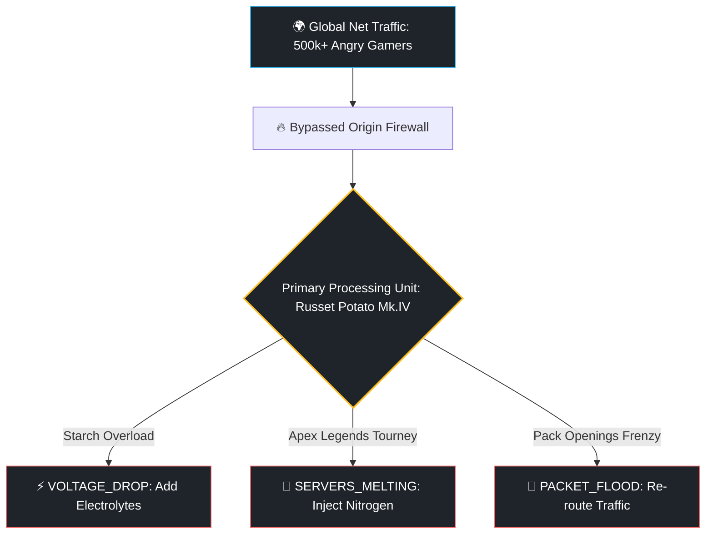

# 🥔 EA Server Overdrive (Ultimate Defibrillator CLI)


A Hollywood-style, hyper-stressful hacking simulation terminal where your single mission is to **keep the EA (Electronic Arts) matchmaking network online on pure willpower and starch.**

Every gamer and developer knows the universal truth: EA servers are held together by hopes, dreams, and agricultural root vegetables. In this simulation, you have breached the core infrastructure perimeter. Now, you are the lone system administrator in charge of hot-patching memory leaks, pouring liquid nitrogen on fried components, and overcloking the primary potato cluster before millions of FIFA and Apex Legends players crash the entire mainframe.

---

## ⚡ Quick Start (Enter the Mainframe)

No complex enterprise configuration suites or heavy dependencies required. Just raw python threads execution:

```bash
# Clone the repository
git clone https://github.com

# Enter the operations room
cd ea-server-overdrive

# Boot up the server life-support suite
python3 ea_overdrive.py
```

---

## 📐 Advanced Server Hardware Architecture

Our structural engineers have mapped out the state-of-the-art server infrastructure setup powering the current multiplayer matchmaking ecosystem:



---


## 🕹️ Operations Command Suite

When a system anomaly triggers, your server health degrades aggressively. You must input real-time mainframe terminal overrides to mitigate the disaster:

*   **`boost`** — Injects dynamic starch electrolytes into the core root structure. *(Safely mitigates `VOLTAGE_DROP` anomalies)*
*   **`cool`** — Dumps a bucket of liquid nitrogen over the master smoking rack. *(Safely mitigates `SERVERS_MELTING` anomalies)*
*   **`route`** — Diverts millions of routing requests into a black hole or a decoy server. *(Safely mitigates `PACKET_FLOOD` / `DDOS_ATTACK` anomalies)*
*   **`patch`** — Forces a raw, unverified micro-fix code block directly into the live production cluster because testing environments are for the weak.

---

## 🔥 Features Included

*   **Cinematic Hollywood Boot:** Simulates a gorgeous retro hacking loading screen bypassing security firewalls before launching into the live cockpit.
*   **Asynchronous Multi-Threaded Engine:** Crises and server degradation calculations run in real-time on independent background daemon threads while listening to your terminal keyboard prompts.
*   **Pure Vanilla Python:** No `pip install` fatigue, no compilation overheads. Native ASCII graphics rendering working across Linux, macOS, and Windows.

---

## 🤝 Contributing (Agriculture Upgrades)

Did you find a way to replace the potato with a sweet potato for 15% better caching intervals? Or did someone spill an energy drink over the server motherboard? Pull Requests are highly encouraged!

1. Fork the Operation Room
2. Implement your custom disaster scenario or performance script tweak inside `ea_overdrive.py`
3. Commit your hot-patches (`git commit -m 'Add Gremlin Microwave interference scenario'`)
4. Push upstream (`git push origin feature/AmazingPatch`)
5. File a Pull Request before the weekend deployment shift ends.

## 📝 License

Distributed under the MIT Satirical License. See `LICENSE` for more information regarding potato safety guidelines.
